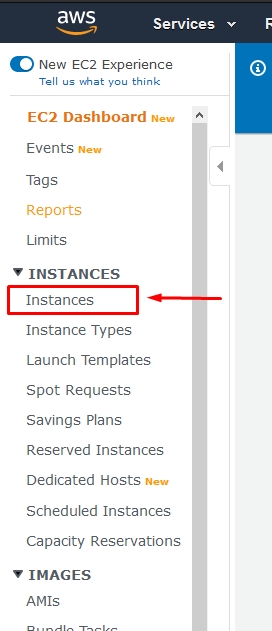

# Running Gromacs applications in the cloud

This tutorial will show you how to deploy Gromacs, a distributed application, on the [Amazon Web Services plataform](https://aws.amazon.com/).

## 1. Basic info
This first step will create an base image with our application and a MPI implementation. [MPI](https://en.wikipedia.org/wiki/Message_Passing_Interface) is a high performance communication pattern. Our image will look like the following image:

We will generate an RSA key, install a SSH server, an MPI implementation and compile Gromacs.

Altough most implementations support differnt hardware for communication (i.g. InfiniBand and Ethernet), MPI uses SSH to spwan the envoriment on every node and thus requires that a connection can be made without interactive password insertion. To achive this, we will copy the generated RSA key to the list of accepted keys. Doing this, when we achive the following:

In the last steps, when we create more than one instance, since they use the same base image, they will have the same RSA key and thus accept connections from each other, making them ready to run the MPI application without additional configuration.

## 2. Creating the Base image
To create the base image we will need a machine. To this, first create and AWS account and go to the console page. Then, click in Services (located at the top bar) -> EC2:

This will load a page with a "Launch Instance" button. Click on it:

In this tutorial we will chose the Ubuntu Server 16.04 LTS (HVM) image:

Now, select the t2.micro machine. We will use this machine to install the required programs and compile Gromacs.

General purpose t2.micro
Configura Instance Details

chown 600 $PEM_PATH

ssh -i $PEM_PATH ubuntu@$IPV4_IP

mo833_rfreitas

