# Running Gromacs applications in the cloud

This tutorial will show you how to deploy Gromacs, a distributed application, on the [Amazon Web Services plataform](https://aws.amazon.com/).

## 1. Basic info
This first step will create an base image with our application and a MPI implementation. [MPI](https://en.wikipedia.org/wiki/Message_Passing_Interface) is a high performance communication pattern. Our image will look like the following image:

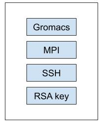

We will generate an RSA key, install a SSH server, an MPI implementation and compile Gromacs.

Altough most implementations support differnt hardware for communication (i.g. InfiniBand and Ethernet), MPI uses SSH to spwan the envoriment on every node and thus requires that a connection can be made without interactive password insertion. To achive this, we will copy the generated RSA key to the list of accepted keys. Doing this, when we achive the following:

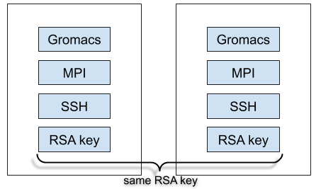

In the last steps, when we create more than one instance, since they use the same base image, they will have the same RSA key and thus accept connections from each other, making them ready to run the MPI application without additional configuration.

## 2. Creating the Base image
To create the base image we will need a machine. To this, first create and AWS account and go to the console page. Then, click in Services (located at the top bar) -> EC2:

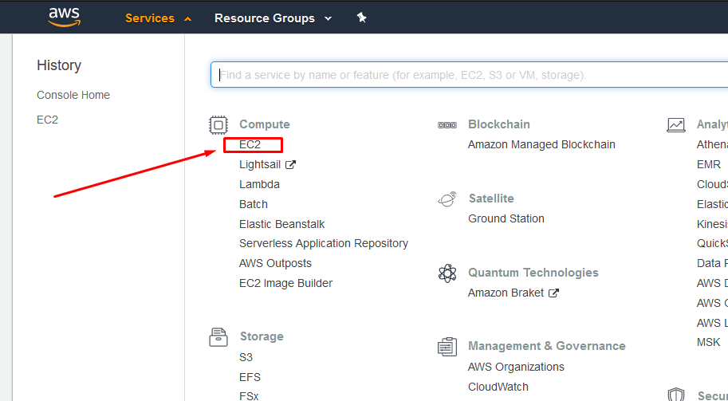

This will load a page with a "Launch Instance" button. Click on it:
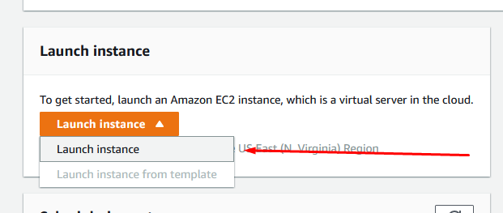


In this tutorial we will chose the Ubuntu Server 18.04 LTS (HVM) image:
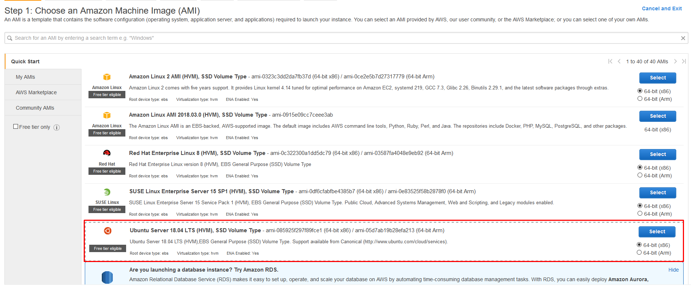

Now, select the t2.micro machine. We will use this machine to install the required programs and compile Gromacs.

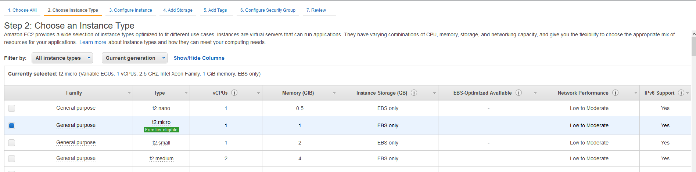

The next page shows some installation options. You must change only the last option, to add the Gromacs installation instructions:

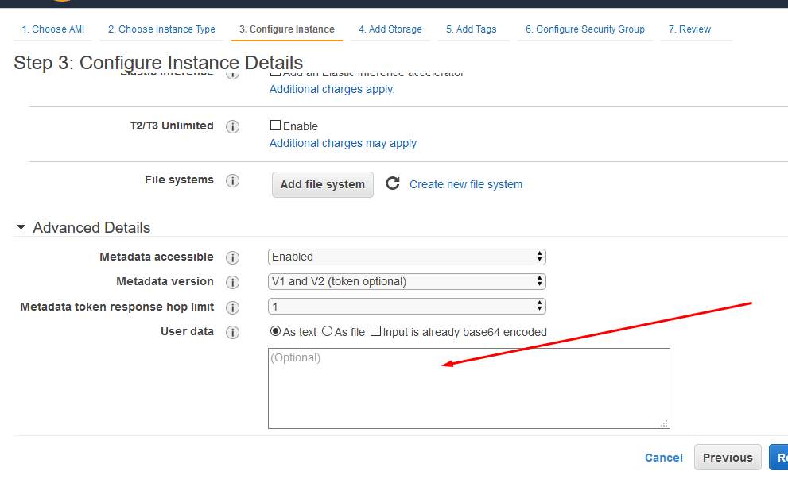
In this box, paste the text present on the `setup_ubuntu_machine.sh` file.

Now launch the image and download your key. On this page, get the machine public DNS and get instructions on how to connect to it when it is ready:

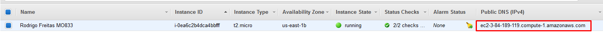

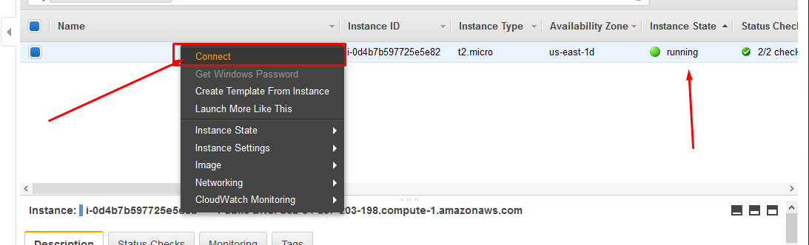

The installation process is already running (the machines is already executing the instructions we pasted on the steps above) and will take a while, specially if you chose a machine with low computing power. To follow to progress you can SSH to it and run:
```
$ ssh -i "your_key_path.pem" ubuntu@machine_public_dns

$ watch -x progress.txt
```
The 'Building Gromacs' bit is the longest one (good time to take a break from the screen).

When done, the script writes the line "Done" to the text file located at `/home/ubuntu/progress.txt`. When it looks like the image below, we can save the image (it is ready to run in our cluster!).

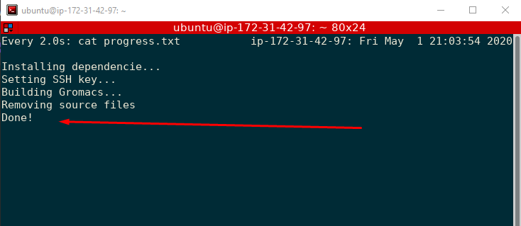

To save the image, go to the managment page and right-click on the instance. Go to Image -> Create Image.
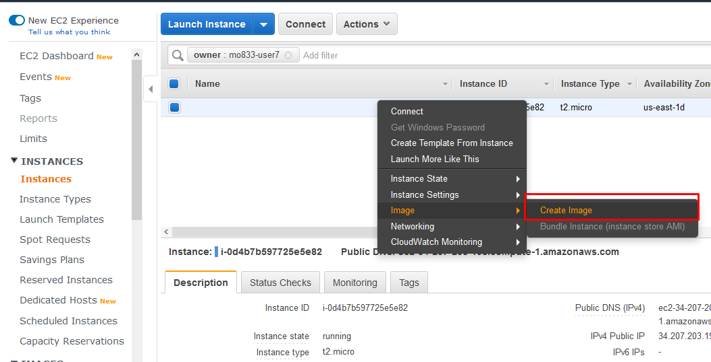

Just give it a nice name and click on the big blue button:
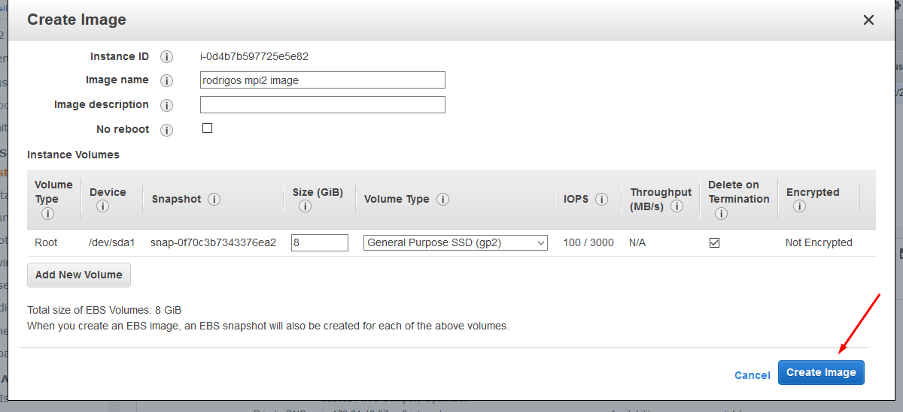

Since we got our image, we can TERMINATE the machine. This will send destroy the machine forever (a very long time). But we have the image, so no reason to worry (or waste money on this machine).

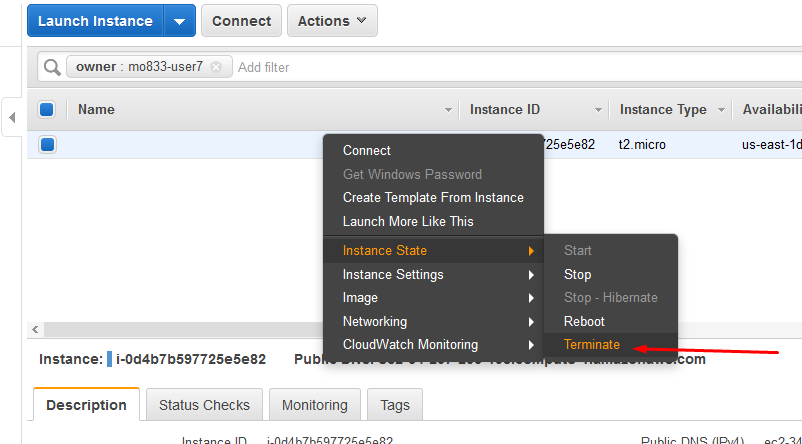

We have an image READY to run MPI apps, let's use it!

## 2. Using our image to run the Gromacs simulation
### 2.1 Creating the security groups
Before using our image, let's create a security group to allow our machines to communicate with each other. To to this, let's create the security groups:

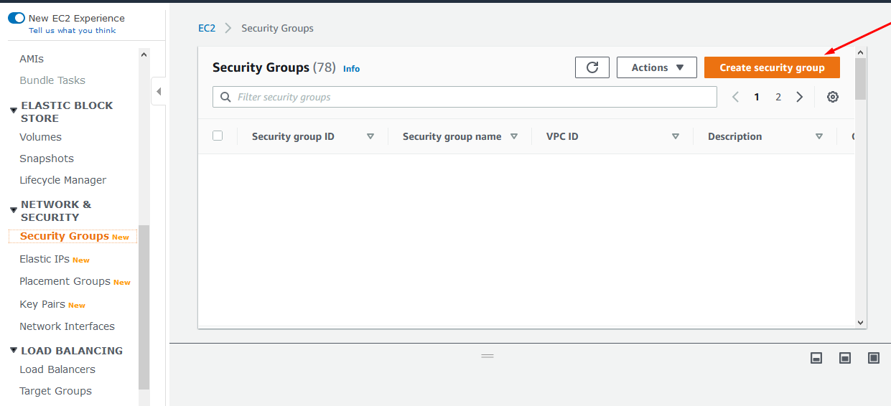

First, we create the group necessary to use our machine though SSH:

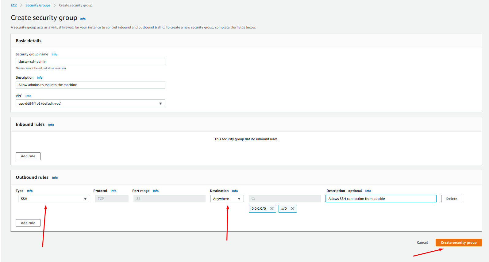

Now, we create the group to allow the communication between the VMs:

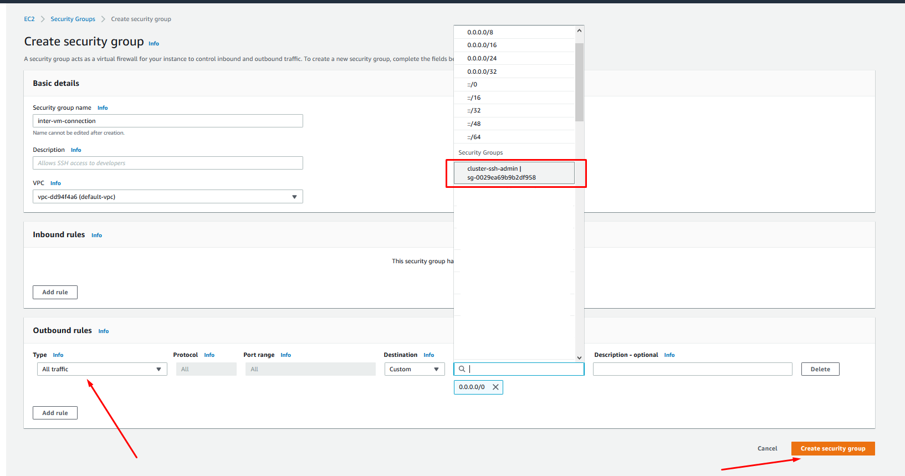

### 2.2 Deploying the cluster
To use our image, just go to the Launch image section and select the image we just built:

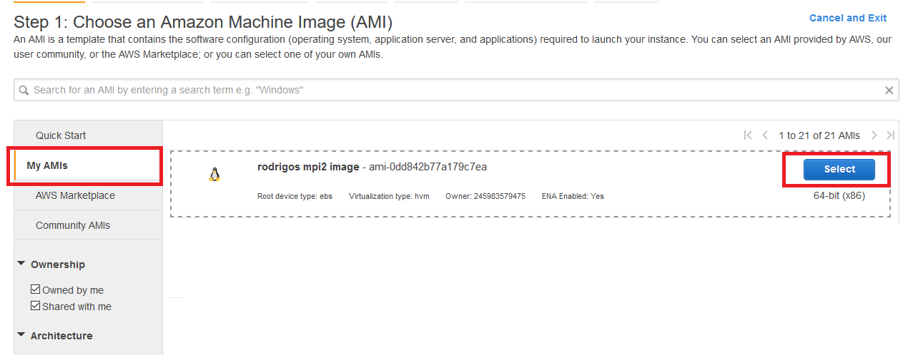

Choose a machine that best fit your computational needs. Next, select how many nodes your cluster will have:

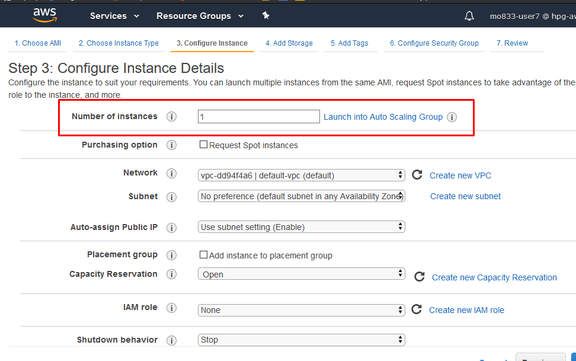

Now, select the two security groups we created earlier:


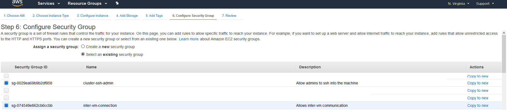

And now, everything is set. We must get the private IPs of each machine. To do this just click on the instance on the manage page:

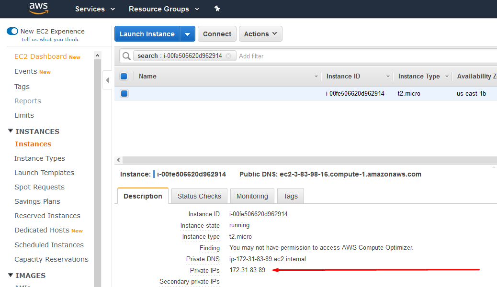

SSH to one of the machines and create a text file called `hostfile` with the IPs:
```
<IP1>
<IP2>
```
Now, just run our simulation on the nodes :)

`$ mpirun -np N gmx mdrun_mpi -v deffnm em`

(replace N with the number of instances)

