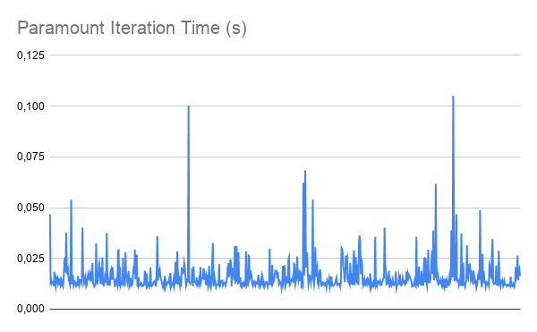

## Identifying paramount iterations

Many scientific applications (like Gromacs) have a loop that consumes most of the execution time can be viewed as a round of computation and inter-process communication. We call one iteration of this loop a paramount iteration. Since most of the time is consumed here, we can measure the time taken to run one paramount iteration and use it to estimate the time needed to do a complete execution, if we know beforehand how many paramount iterations the application needs to finish.
To identify the loop responsible for the paramount iterations in Gromacs, the program was previously profiled. The report can be found here: https://github.com/fopor/gromacs-mo833a/tree/ativi-4-exp-1/experiments. 

## Instrumenting Gromacs' paramount iterations
This repository contains the modified code used for instrumentation. It uses the time.h library to get the elapsed time between each iteration and the init time (time spend before the start of the first paramount iteration).
Gromacs was compiled using the ./build_gromacs.sh script and run with ./gmx mdrun -v -deffnm em.

## Results
The standard output of the run can be found at the output.txt file. The results are as follow:
Init time:   0.0590s

Finish time: 0.0679s

Average paramount iteration time: 0,016235s

Number of paramount iterations needed in a complete run: 816.

Time of each paramount iteration: 

(This data can be found on the sheet: https://docs.google.com/spreadsheets/d/1hBJZhqwvYjBF2eSKeEdabCoMSITS3h6jj5zz0i6oy0c/edit?usp=sharing)
