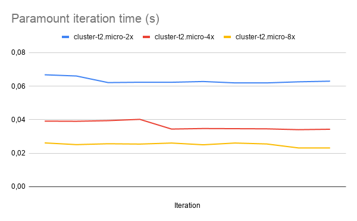

# Using CLAP to deploy Gromacs-ready clusters

[CLAP](https://github.com/lmcad-unicamp/CLAP) provides an interface to deploy HPC applications. The folders groups and configs contain the necessary files to deploy an AWS cluster ready to run Gromacs. This version of Gromacs has been modified to run 10 paramount iterations and then exit, reporting the time spend in each iteration.

## Usage
After installing CLAP, simply copy the configuration files from groups and configs folder. Those files define three types of clusters of t2.micro machines and the playbooks needed to install Gromacs, MPI, and run a simulation.

### 'gromacs' group
All the actions needed to run Gromacs on the cloud are in the gromacs group. 

|      Action      |                        Description                        |
|:----------------:|:---------------------------------------------------------:|
|       setup      |                Download and install Gromacs               |
| simulation-setup |            Downloads the simulation input file            |
|        run       | Execute Gromacs using MPI across all nodes in the cluster |
|   fetch-result   |                 Downloads execution output                |

### Cluster configurations
|                     |               Description              |
|:-------------------:|:--------------------------------------:|
| cluster-t2.micro-2x |  A cluster with two t2.micro machines  |
| cluster-t2.micro-4x |  A cluster with four t2.micro machines |
| cluster-t2.micro-8x | A cluster with eight t2.micro machines |

To start a cluster, run:` $ clapp cluster start cluster-t2.micro-2x`.
Then, add the cluster to the Gromacs grup using ` $ clapp cluster group cluster-0 gromacs`

## Results
The table below contains the time needed to run a paramount iteration on each configuration. The collected data can be found [here](https://docs.google.com/spreadsheets/d/1nlMd-0aVXRfoBHESskhAPq6645uriQ0X9uXUaXU6Jio/edit?usp=sharing).

Since we know that this simulation takes around 700 iterations to finish,  we can use the time needed to do one iteration to estimate the time necessary to do a complete run:

|                     | Time to complete 700 iterations |
|---------------------|---------------------------------|
| cluster-t2.micro-2x | 44.2s                           |
| cluster-t2.micro-4x | 25.5s                           |
| cluster-t2.micro-8x | 17.6s                           |
